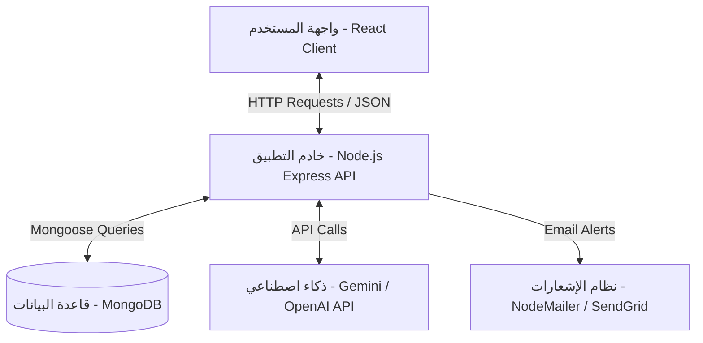

# ARCHITECTURE.md - البنية البرمجية ونظام تشغيل Prime Scope

يوضح هذا الملف البنية البرمجية المعتمدة لمنصة **Prime Scope** وكيفية تدفق البيانات بين المكونات المختلفة.

---

## 🏛️ شرح النظام (System Architecture Overview)

تعتمد المنصة على بنية **Client-Server (زبون - خادم)** مفصولة بالكامل، مما يضمن أداءً عالياً، وقابلية للتوسع مستقبلاً، وسهولة في الصيانة.

---

## 🧩 مكونات المشروع (Project Components)

### 1. الواجهة الأمامية (Frontend Client)
* **الوظيفة**: عرض المنتجات، التفاعل مع المستخدم، إجراء العمليات الحسابية محلياً (الحاسبة)، والتواصل مع الشات بوت.
* **التقنيات**: React.js (مع Vite لتجربة تطوير سريعة جداً)، Tailwind CSS للتنسيق السريع والمتجاوب.

### 2. الواجهة الخلفية (Backend API Server)
* **الوظيفة**: معالجة طلبات المستخدمين، إدارة المنتجات وعروض الأسعار، تنظيم الصلاحيات، والاتصال بالذكاء الاصطناعي الخارجي بشكل آمن.
* **التقنيات**: Node.js مع Express.js لبناء خادم RESTful API.

### 3. قاعدة البيانات (Database Store)
* **الوظيفة**: تخزين بيانات المنتجات (الرخام، الحجر، البازلت)، تفاصيل العملاء، وطلبات عروض الأسعار (RFQs).
* **التقنيات**: MongoDB (قاعدة بيانات NoSQL وثائقية).

### 4. وحدة الذكاء الاصطناعي (AI Module Integration)
* **الوظيفة**: استقبال طلبات العملاء الاستشارية حول أفضل الخامات وتنسيقها وتوفير إجابات فورية ذكية.
* **التقنيات**: ربط خارجي مع Gemini API / OpenAI API.

---

## 🔄 تدفق البيانات (Data Flow)

### 1. تدفق بيانات تصفح وتصفية المنتجات
1. يختار المستخدم فلاتر محددة (مثل: رخام، أبيض، مقاوم للحرارة) من واجهة المستخدم.
2. ترسل الواجهة الأمامية طلباً من نوع `GET` إلى المسار `/api/products?type=marble&color=white`.
3. يستقبل خادم Express الطلب، ويقوم بعمل استعلام (Query) في قاعدة بيانات MongoDB.
4. تعود البيانات كملف JSON يحتوي على قائمة المنتجات المطابقة.
5. تقوم الواجهة الأمامية بعرض المنتجات فوراً للعميل.

### 2. تدفق بيانات حساب الكميات وطلب عرض السعر (RFQ)
1. يدخل العميل أبعاد المساحة المطلوب تكسيتها في حاسبة المنتج.
2. تحسب الواجهة الأمامية الكمية المطلوبة بالكامل بالامتار المربعة تلقائياً وتظهر السعر التقريبي.
3. يضيف العميل المنتج مع الكمية المحسوبة لسلة طلبات الأسعار.
4. عند الضغط على "طلب عرض سعر"، ترسل الواجهة الأمامية طلباً من نوع `POST` يحتوي على تفاصيل المنتجات وبيانات التواصل الخاصة بالعميل إلى `/api/rfq`.
5. يحفظ الخادم الطلب في قاعدة البيانات ويرسل بريداً إلكترونياً فورياً للمشرفين لمراجعة الطلب وتأكيد التسعير الفعلي والشحن.

### 3. تدفق بيانات مساعد الذكاء الاصطناعي
1. يكتب العميل سؤالاً في نافذة الدردشة (مثال: "ما هو أفضل حجر للواجهة الخارجية المعرضة للشمس؟").
2. يرسل العميل الرسالة إلى مسار الخلفية `/api/ai/chat`.
3. يقوم الخادم بدمج السؤال مع *System Prompt* يحتوي على معلومات خامات المنصة ومواصفاتها لتوفير إجابة دقيقة.
4. يرسل الخادم الطلب إلى Gemini API ويستقبل الإجابة.
5. يقوم الخادم بتمرير الإجابة الفورية إلى العميل لعرضها على واجهة المحادثة.

---

## 🛠️ اختيار التقنيات ولماذا (Tech Stack & Justification)

| التقنية | الاختيار | سبب الاختيار والجدوى |
| :--- | :--- | :--- |
| **Frontend** | **React.js + Vite** | تفاعلية عالية جداً، سرعة بناء الواجهات، ونظام المكونات (Components) الذي يسهل إعادة استخدام عناصر التصميم مثل كروت عرض الخامات. |
| **Styling** | **Tailwind CSS** | يمنحنا مرونة وسرعة فائقة في بناء وتصميم واجهة موقع أنيقة وفاخرة تناسب رخام وحجر الزينة دون تضخم ملفات CSS. |
| **Backend** | **Node.js + Express** | لغة واحدة للمشروع بالكامل (JavaScript)، كفاءة عالية في معالجة طلبات الإدخال والإخراج المتزامنة (I/O). |
| **Database** | **MongoDB** | قاعدة البيانات الوثائقية مثالية لمنتجات الحجر والرخام حيث تختلف خصائص المنتجات (بعضها له مقاسات ثابتة، والبعض الآخر ألواح، والبعض يتميز بالصلابة ومقاومة الامتصاص). |
| **AI Engine** | **Gemini API** | قدرات ممتازة في معالجة اللغة العربية وذكاء استثنائي في فهم السياق للمساعدة المعمارية والديكورية، وتكلفة تشغيل اقتصادية. |
